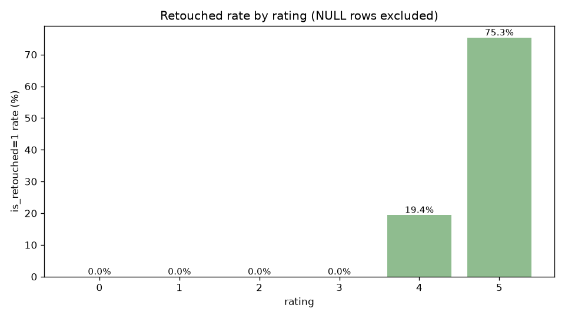
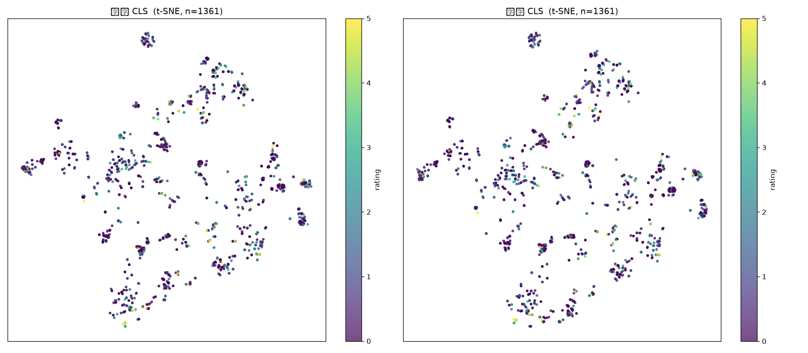
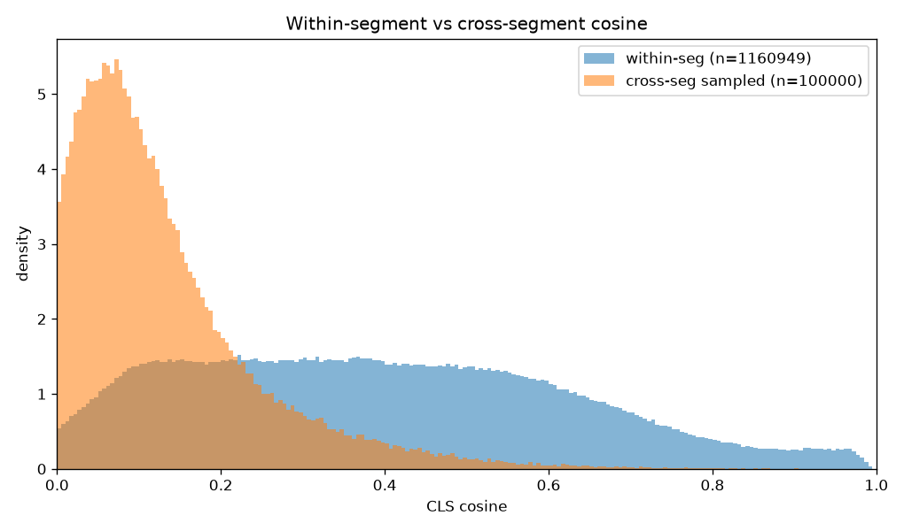
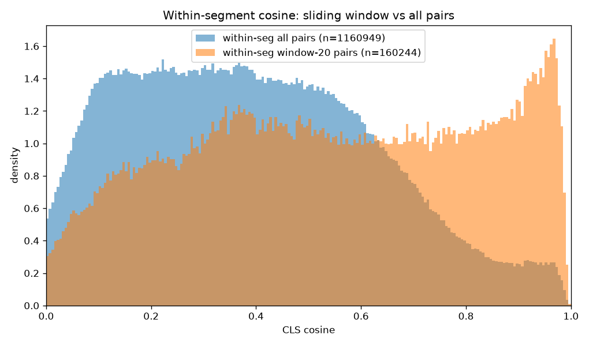
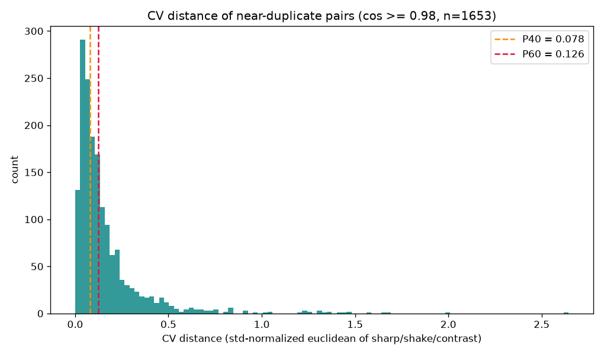
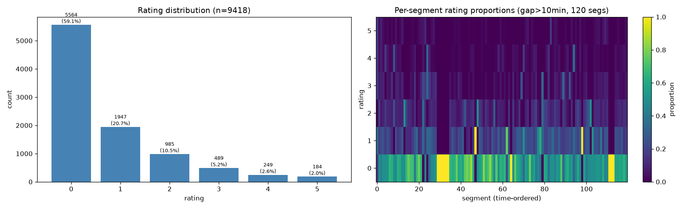
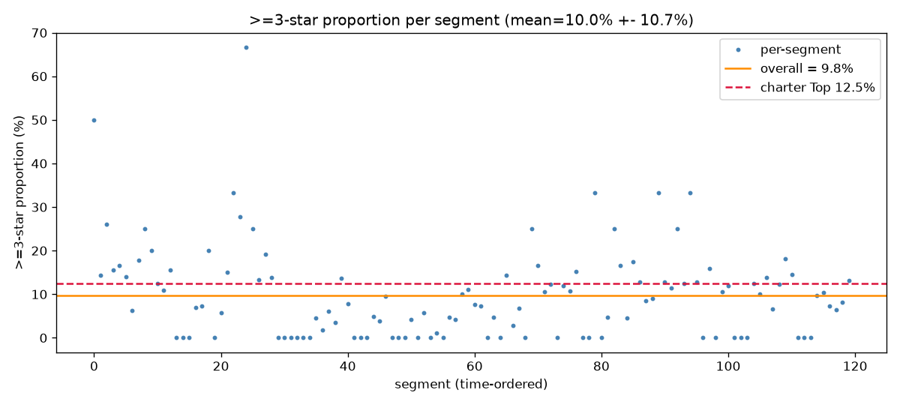
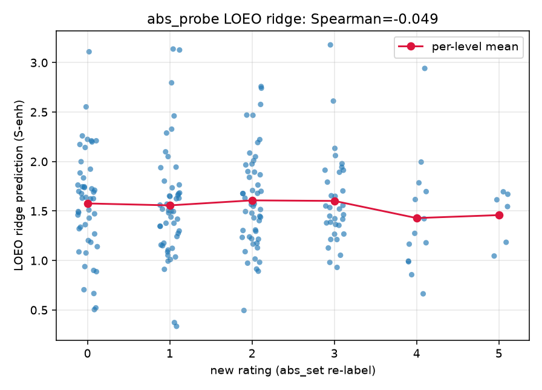
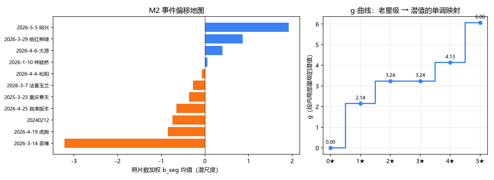

# 分析历程 — 我们如何走到现在的结论

> **人读版叙事**：图文并茂记录三期（DINOv3 照片美学评分）的分析路径——第一阶段（M1：数据地基 + 特征可行性）与训练阶段（M4 起：升级梯、LoRA 与十三实验）——哪些证据改变了决策、现在的结论是什么形状。**持续更新**：后续阶段的分析故事继续追加；过时章节可覆写，优先保留"改变过决策"的证据。
>
> **写作约定**：本文尽量说人话——避不开的专业词在首次出现时附白话解释，文末附[名词表](#附名词表)。
>
> 机器真源：[../STATUS.md](../STATUS.md)（当前进度）/ [../EXECUTION-LOG.md](../EXECUTION-LOG.md)（逐次实验台账）/ [../plans/](../plans/)（宪法与分册计划）；本文是它们的叙事化索引。最后更新：2026-07-27。

---

## 0. 一句话现状

**训练阶段一天 13 个实验打完：精细排序各路全灭，但"高分段粗判断"站住了**——系综（四个模型投票）在"确有差距"的照片对上，与你亲手校准的尺有 **75.5%** 一致率（没见过的外拍上实测）。现阶段规则已明确：**产品化一律后置，模型准确性是唯一成功判据，最低成功限度 = 局部弱实现**（三级台阶，见 §10）。本章讲这 13 个实验如何把"能怀疑的都怀疑一遍"，以及下一步往哪打。

---

## 1. 起点：要替代什么，手里有什么

- **要替代的**：一次外拍约 600 张、约 **5 小时**人工筛片；目标是把需要细看的压到 **12.5%（约 75 张）**，且真正的 3★ 以上照片 80% 以上不被漏掉。
- **手里的数据**：9418 组照片（同一次快门的 RAW/JPG 合为一组）、11 场拍摄、按 10 分钟停顿切成 120 个拍摄段；每张照片存了：整图特征向量两份（原图版 + 增强版——模型把整张照片压成的一串数字，代表"画的是什么"）、分块特征、物理画质网格（锐度/抖动/对比度的仪器测量），外加拍摄参数和你打的 0-5 星。
- **标签的本质（一切分析的出发点）**：你的星级是每段内部"锦标赛"逐轮晋级出来的——低星（0-3★）偏"临近几张里挑好的"，高星（3-5★）偏"整场里挑总体最好的"。所以它给出的**同段内的相对信号很强，跨段、跨场的绝对信号几乎为零**（好天气的 3★ 和坏天气的 3★ 实际水准差很多，但标签一样）。这个性质决定了后面所有的失败与出路。

## 2. 数据地基：先确认标签能信

- **层级交叉验证**：硬盘文件夹层级（无后缀=0★ / -OK=1-2★ / ARW3=3★+）与文件里记的星级比对，**5170 组零不一致**——星级可读性过关。
- **0★ 语义终裁（你拍板）**：两个盘**全部评过，0★ 就是真 0★**（不再当"没评"）。补齐 2732 条空值后全库 9418 组无缺失：0★5564 / 1★1947 / 2★985 / 3★489 / 4★249 / 5★184。
- **精修照片回溯（下一阶段"顶级参照桩"的关键来源）**：8 个修图导出目录共 152 件，按"文件名（剥掉 `@JPG` 后缀）+ 所属场次"对回原片，**150 张精修原片成功落标**，零误伤（含相机计数回绕造成的 14 个跨场同名，逐案核实处置）。

> **精修只落在高星**：5★ 里有 75.3% 被精修过、4★ 有 19.4%、0-3★ 为零。这不是缺陷，是语义——"我愿意花时间修它"是**只存在于顶级照片的强偏好信号**。所以它只能当下阶段的**顶端参照桩**（少量、高精度、按张高权），不能当全体照片的统一监督。

## 3. 特征可行性试探：一部三连否定的故事

核心问题：**底座模型算出的照片特征，用尽可能简单的规则，能不能分出"同一段里哪张星级更高"？**（宪法决策 7：正式训练前先做这种试探实验，80% 以上算底座够用。）

### 3.1 第一试（2026-07-18，只有雾天一批）：全灭，但分不清死因

单日雾天纯风光批，把整段藏起来当考卷，三种特征用法全部 40-45%——**全是扔硬币水平**。但这批内容太同质，分不清是**猜想一（特征本身弱）**还是**猜想三（单批同质的最坏情况）**。结论：别急着怪模型，先建多样批。

### 3.2 再试（2026-07-19，10 场多样批）：猜想一锁定

> **这张降维点图是"猜想一"结论的肉眼版**：1361 张照片的特征压到二维，颜色=星级。点全按**内容**聚堆（同场景挤成一团），颜色却在各堆内**随机混杂**——特征记住的是"拍的是什么"，不是"哪张更好"。（图题方框是画图库没有中文字体的乱码。）

数字版更狠：多样批、整段藏考，全部 24 种组合 **47–51%**。而且三组诊断把"也许还有救"的解释逐一封死——

- **按星级边界拆**（0-1★ 技术边界 vs 3-4★ 美学边界）：全在 45-50% → 不是"能分技术、不能分美学"，两头一样灭；
- **按场次拆**：各场 41.6-53.0% → 不是某类题材的问题；
- **给每场单独配一套判断规则**（每场一个方向，4224 维）：还是扔硬币 → 也不是"一套规则表达不了各场不同的标准"。

**猜想一坐实**：小号底座模型的整图特征差异，不携带能跨段使用的"谁更好"信号。

### 3.3 标注学引入：唯一的正面信号

你确认了两段标注机制（低星局部比、高星整场比）之后，试探实验拆成两种配对范围：**局部段（0-3★，临近滑窗内配对）**与**全局段（≥3★，整场内配对）**。结果全局段在"同一场内学一部分、考另一部分"时达 **79-84%**——高星美学排序在**同一场的语境内**确实可学（局部段只有 60-62%）；但**换成"学十场、考没见过的第十一场"，立刻掉回扔硬币**。形状：好坏信号在每场内部真实存在，就是不跨场迁移。

### 3.4 猜想二（信息在压扁时丢了）也排除

"会不会是整图压成一个向量时把细节丢了？"——保留 32×32 空间结构的读法（空间金字塔/微型卷积头）同样 49.4-50.7%，连练习题都学不利索。**瓶颈是特征本身，不是压扁。**

## 4. 换大号底座模型（ViT-L）再试：2×2 定案

按宪法的升级梯，用大号模型把 9418 组照片的特征重算一遍（与原版一致性校验满分），同一套实验双模型同口径对比：

| | 跨段/跨场考（迁移能力） | 同场内考（可学性上界，含泄题） |
|---|---|---|
| **局部段** | 小模型 49.9 → 大模型 53.0 | 小模型 61.3 → 大模型 65.9 |
| **全局段** | 小模型 50.0 → 大模型 51.0 | 小模型 79.3 → **大模型 90.2** |

**判读**：跨场迁移大号只换 +1~3 个百分点、仍贴 50%（离 80% 过关线极远）→ **换大模型解决不了跨场问题，它是标签结构问题**；同场内 +10 个百分点是真实差距，但那是泄题口径的上界，兑现不到新场上。于是：

- **主路定案**：跨场统一分数只能从**标签以外**引入——人工给每段打偏移分、精修照片当顶级参照桩、特征自身的泛化——即下一阶段（M2）的锚定路线，与底座模型大小无关。
- **底座定格小号 ViT-S**（你拍板）：四份特征已全量入库、移动端 86MB 可落地；大号路线不死锁（特征已共存入库，想升级约 1 小时能重提一轮；后面还有提分辨率、低成本微调两级梯子）。

## 5. 分布审计：看清数据的真实形状，把门槛全部校准

> **本审计最关键的一张图**：同段内配对（蓝）的相似度分布一路拖到 1.0，跨段配对（橙）在 0.725 处（千分位）彻底归零——**相似度超过 0.88 的对几乎必然同场景**（同段 2.66% vs 跨段 0.007%，差 380 倍）。宪法"拿内容相似度当'可不可比'的主信号"有了定量地基，低相似门槛 0.73（跨场景混入 <0.1%）由此定。

> 橙色（20 张滑窗内配对）在 0.9-1.0 高相似区鼓起——滑窗确实捞出了"临近相似"的比较域（你选片时的真实工作域）。窗口 20 张对最像那批对的覆盖 88.3%；加到 40 只多覆盖 5.6%、对数却多 88% → **窗口定格 20 张**。

> 1653 对"几乎一模一样"（相似度 ≥0.98）照片的物理画质差异分布：左端贴零那一坨是"真平局"（只能随机挑一张的极相似对）——判平局丢弃的画质门槛 0.078~0.126 由此分布定。

> 左：全库 0-5★ 金字塔。右：120 段每段星级占比热力图——各行颜色跨段大体均匀，**"每段星级分布大致相同"（锦标赛段内归一化）在大段层面成立**（≥30 张的段，分布差异度均值 0.057），小段波动是采样噪声。

> 每段 3★ 以上占比散点：均值 9.8%，围绕理想值 12.5%（虚线）大幅浮动——**你裁定**：12.5% 是理想锦标赛值（三级各过 50%），实际逐级过选率在 35-60% 浮动，实测 9.8% 只是这批的实况、**不改产品目标口径**。左侧那簇高占比段就是"好天气场次"的真实画像。

**校准值（冻结）**：窗口 20 张；高/低相似门槛 0.98 / ≈0.73；平局画质门槛 0.078~0.126；相似度→权重对照（0.973→满分 1.0 / 0.918→0.8 / 0.786→0.5 / 0.540→0.3 / 0.73 以下→0）；下一阶段人工打偏移分的工作量 = 120~240 张评级、半天到一天（可行）。

## 6. 亲手造一把跨场的尺：信息在特征里，迁移不在

第一阶段的最后一道验证。前面证明的是"老星级跨场不可比"，但还可以问得更直白：**如果亲手造一把跨场统一的好坏尺，模型能直接读出来吗？** 于是有了 §1.5：把 200 张 3★ 以上的照片抹掉星级、改成中性名，你按满量程 0-5 盲评重打（水平相近打同星、保证高星普遍比低星好），拿这把新尺直接考特征。

- **新尺本身告诉我们的（不碰模型——"跨场错位"第一次有了体量数字）**：新分布 0★48 / 1★49 / 2★50 / 3★33 / 4★14 / 5★6（尺子的刻度是你定的，所以新老星级**只能比排序、不能比数值**）。① 新老星级的**排序一致性 = 0.29**（0=毫不相关，1=名次完全一致；你是盲评，所以这是测出来的不是造出来的）——老星级携带的跨场好坏信息：**弱、但真实存在**；② 把新尺的差异按来源分摊：**场次之间只占 14.7%，同一场的不同段之间占 34.1%，同一段内张与张之间占 51.2%**——意味着"给每段打偏移分"最多只能解决约一半的差异，另一半是每张照片自身的真实审美差距；注意**段与段之间（34%）比场与场之间（15%）还大**，所以偏移分必须打在段级、不能打在场级；③ 每场的新星均值：绍兴 2.41 最高、茶博 0.33 最低，极差约 2.1 星——"好天的 3★ ≠ 坏天的 3★"第一次有了量级数字（各场样本 9-32 张，噪声不小，仅作地图参考）。
- **拿新尺考模型**（考法：每次都藏起一整场不让模型学，模拟"明天新拍的一场"；50% = 扔硬币）：

| 考法 | 成绩 | 含义 |
|---|---|---|
| 泄题考（练习题和考卷含同一场） | **99.1–99.6%**（换灵活读法 100%） | 信息明明在特征里，只是带不到新场 |
| 藏一场考 · 场内排序（主考） | 小模型 50–52% / 大模型 55–57%；换更灵活的读法复核：小模型 **49.9%** / 大模型 57.6% | **跨场不迁移，且不是"读法太简单"的问题** |
| 藏一场考 · 跨场对比 | 71–76% | 只有"这场整体比那场好"这种粗判断能带走 |

- 用最简单的直线拟合直接预测分数：排序一致性 ≈ 0。下图里每个新星级的预测均值线全程水平——模型对"没见过的场里的照片值几分"完全没有概念。

- **判词**：放回目标上看——**保底方案不受影响**（段内排序 + 每段配额 + 去重 + 废片闸门，本来就不依赖跨场分数；本实验测的是跨场绝对尺，不测段内排序）；受冲击的是上行目标"跨场统一的美学分"：粗尺那一半（约 49% 的差异，场+段两级）可以靠下一阶段的人工偏移分缝出来，细尺那一半（约 51%，每张照片的真实差距）只能靠模型自己的判别力——而本实验证明现成特征怎么读都读不出来（只有"最好 vs 最差"的极端对、和"这场比那场好"的粗判断上有信号）。所以按预定规则走"结果差"分支：**人工偏移分加重、且打在场内的段级；低成本微调底座模型（LoRA）从"可能要"升为"大概率要"；今后一切考试按整场藏考**（泄题考 100% vs 真考 50%——不切场，成绩全是假象）。大模型在场内多出的 4~6 个百分点，依旧只是"升级路不死锁"的注脚。
- 工具与数据：`Training/probes/abs_probe.py`；重标集 `D:\PhotoDB\dataset\abs_set\`（对照表 + 读回文件负责把副本对回数据库）；你这 200 张盲评标签本身也资产化了 = 下一阶段绝对池的试点 + 再往后测"绝对感"的现成考卷（局限：只覆盖 3★ 以上这段，全量程的段代表还要补）。完整数字见 [EXECUTION-LOG](../EXECUTION-LOG.md) 2026-07-19 §1.5 条（含一次判读更正记录）与 `probes/out_abs/abs_probe.md`。

## 7. M2：全库第一把统一的尺——约 400 张人工排序，换来了什么

到 §6 为止，我们手里只有一堆"各段自用的小尺"。这一步把它们缝成了一把全库总尺，而且**只花了你两个半天**。

- **做法（排序进、排序出）**：你分两批盲评了约 400 张照片（abs_set 200 张 + 标注池 205 张），要求只有"水平相近放同档、高档普遍比低档好"；机器给 120 个段各找一个抬压量，让全库 9418 张排出来的总顺序尽量对上你给的每一对先后。**全程没有数值运算——你给的是先后，得到的也是先后**（宪法 v1.7：星级只有排序）。
- **尺子的成色**（故意留出 20% 你标过的照片不参与拟合，再考）：

| 两张照片在你的尺上离多远 | 模型判对先后的概率 |
|---|---|
| 明显差距（差 3 档以上） | **91–95%** |
| 差两档 | 78–84% |
| 相邻档 | 65–71%（≈ 你自己的重复率） |

- **对最终目标的意义（这步的价值）**：
  1. **项目最大的结构障碍有了第一个实体答案**。"老星级跨场不可比"（挑战 3）曾把绝对美学分判为项目的"核心不确定性"；特征白拿被证死后，答案落在**少量人工判断 × 锦标赛结构放大**——你只看了约 4% 的照片，但每张照片都被它的团/段代表"代言"上了尺。绝对分这条上行线，第一次从概念变成了 9418 行的产出。
  2. **选片意义直接可讲**：明显好的照片不会被埋（差 3 档以上九成以上不判反）、明显差的冒不了头——**Top 12.5% 名单的"身子"稳了**；名单的"边缘"是糊的——边界线附近的进出误差来自整数星级本身的粒度（你自己重标都会浮动一档），而产品的"低置信度回人工复核"正是为这条模糊边缘准备的，不是缺陷。
  3. **三个有长期价值的附带发现**：① **老 2★ 和老 3★ 在新尺下完全不可分**（下图右）——锦标赛中间层几乎不带绝对信息，硬边界只有 0→1（"是不是有效照片"）和 4→5（"是不是精品"）。但"别学中间层"要说得更准：真正脏的不是中间层本身，而是**"相似组落败者的压低星"**——输给近重复兄弟 ≠ 绝对差（我们的锚点以团顶为主，所以 g 曲线量的主要是"段间标准不一"，不是压低）。下游分工因此明确：**绝对尺只学团顶与孤立照的清洁星级**（没被压低过）；团内详细排序本身是**精细美学判别**（连拍间的构图/瞬间取舍正是选片日常，也很可能就是 0-3★ 探针难分的真因——高相似下判别本来就难），只有"真无差异"才判 tie，"等价只留一张"的展示压低才归去重算法；② **事件偏移地图和你的体感一致**（下图左）——尺子可信的直观证据，也是"好天 3★ ≠ 坏天 3★"的最终量化形态；③ **大段胜负记录满足率只有 0.707**——锦标赛晋级路径依赖噪声的实测，给"免费信号只能当参考"定了量。
  4. **方法论立碑**（你裁定、已入宪法）：整数舍入是标注的量化噪声——**AI 不该学它**（相邻档约束降权；实测降不降都一样，模型本就学不动），**也不许拿它当降低标准的借口**（闸门只卡真实差异处：重复件跳档、差 2 档以上的回测）。此后所有评估继承这条原则。

> 左：事件偏移地图（每段的抬压量按场平均）——绍兴最高、茶博远低于其他，与你盲评的高低感受一致。右：g 曲线（老星级到新尺的单调映射）——2★ 和 3★ 塌成同一个值（3.24），中间层无绝对信息；0→1 与 4→5 才是硬边界。

- 工具与数据：`Training/audit/m2_pool_builder.py`（代表池生成）→ `m2_offset_fit.py`（排序拟合 + GATE）；产出 `audit/out/m2_offset/latent_scores.csv` + `m2_offset_report.md`；完整数字见 [EXECUTION-LOG](../EXECUTION-LOG.md) 2026-07-19 M2 校准条。

## 8. M1 结论的形状

三句话收束第一阶段：

1. **靠得住的能力是同场内的相对排序**（同场内学考 79-84%，大模型 90-94%）——保底交付（段内排序 + 每段 Top 配额 + 去重 + 废片闸门）在构造上就成立；
2. **跨场统一分只能靠人工监督教出来**——裸特征零迁移，被两个模型、再加你这 200 张真尺各证了一次；下一阶段的锚定（人工偏移分 + 精修参照桩 + 这 200 张绝对池）是唯一的输入源；
3. **特征不是瓶颈、标签结构才是**——后续投入全部押在锚定与配对工程，不再折腾底座模型；所有评估按整场切分。

**后续**：M2 已落地（见 §7——跨段绝对校准 GATE 通过，全库统一的尺产出）。

## 9. 首考：墙的确切位置，和唯一的脉搏

M3 把教材备齐（三类对比题各守纪律、整场切分防作弊），M4 第一次用真模型考"没见过的场"——结果把探针时代所有线索收拢成了定论：

- **能背，不能带**：模型把训练场学到对级 97.7%，考新场只剩 ~0.52（扔硬币）——和线性探针当年说的一模一样，这次是真模型复现，再无疑义。
- **三种特征各自的死法**：语义特征（CLS）纯记忆；物理画质的全图统计连记忆都做不到（粒度太粗）；**EXIF 拍摄参数反迁移**——它学的是"哪场爱用什么镜头"，换个场就反噬（绝对涌现三项全负），从此只做分桶元数据、不进打分特征。
- **唯一的脉搏**：大模型 ViT-L 把段内 top-1 从 0.10 推到 0.19~0.33（随机 0.155）、绝对对也从贴 0.5 推到 0.63——弱，而且不稳（不同轮次漂移 ±0.1），但是真的。**1024 分辨率没有放大它**（你的预判兑现）——瓶颈不在像素、不在模型大小，在于冻结特征本身不含可迁移的细粒度审美方向。
- **结论**：升级梯前三梯（S@518 / L@518 / L@1024）全部证死，**决战在梯 4 LoRA**——直接微调底座模型本身，让特征为我们的任务长出来。这是宪法预留的"最终逃生梯"，4080 出马。
- **工程教训（留给梯 4）**：小 val 集近随机时早停不可靠（选的 checkpoint 近乎随机，test 指标漂移 ±0.1）——复测要固定训练预算或多种子，主指标组 = 段内 top-1 + 段内序相关 + 差 2 档以上对级 + 3★ 召回。

---

## 10. 训练阶段决战：一天 13 个实验，把能怀疑的都怀疑一遍（2026-07-27）

> 本章是模型训练阶段的总叙事：**目标 = 准确性（不是产品）；方法 = 怀疑 → 证伪 → 认知升级；
> 结果 = 精细排序各路全灭，"高分段粗判断"站住（0.755）。**
> 阶段规则（你定）：**现阶段不考虑任何产品化；模型准确性是唯一成功判据；最低成功限度 = 局部弱实现。**

### 10.1 先定义"最低成功限度"：三级台阶

| 台阶 | 任务 | 人话 |
|---|---|---|
| ①（最低线） | 任意两张高分段照片，谁强谁弱 | 明显有差距的对，判断对方向——允许排除"重复压低"污染数据 |
| ② | 相似组内选优（选团顶） | 一串连拍里指出"你会留哪张" |
| ③ | 团顶之间排序 | 各组冠军放一起，把真正的好片筛到前面 |

### 10.2 开考前，先保证"考卷是真的"

微调要吃原始像素，像素必须和当年建库时的预处理**逐像素一致**。第一版用 Python 复刻 C# 渲染管线，自检闸门立刻抓包：**同一照片，Python 渲染算出的特征与库内特征余弦只有 0.90**（解码器/缩放实现差之毫厘，深度特征差之千里，换 4 种缩放滤波器都救不回）。**处置**：放弃复刻，让 C# 自己把"喂给模型的那张图"原样导出（DatasetBuilder 新增 `--dump-render`），复检余弦 **1.0000**——训练像素 ≡ 建库像素 ≡ 未来部署像素。这一课值半天：**考卷不真，后面所有成绩都是假的**。

### 10.3 梯 4 首考：最后的梯子也到顶了

LoRA 微调（只改底座 0.6% 参数）三回合：**训练场对级 98%（全背下来），新场段内 top-1 = 0.143（随机 0.155）**。逐轮轨迹更说明问题：第一轮还远没背熟时就已贴随机——**不是过拟合太快，是新场上根本没有可迁移的东西可学**。升级梯四级（换大模型/换高分辨率/换微调）至此全部证死。

### 10.4 怀疑链第一章：是不是读出头不对？

你的假设：DINO 的分块特征（patch token）目测是"忽略内容、只留构成"的抽象——构图信息该从空间结构里读，不该压成一个整图向量。**专设对照实验**（E1：空间注意力头，其余全同）：相似带判别 0.55，**没打过**整图向量的 0.59。**证伪**——至少这种读法下，构成信息读不出来。

### 10.5 第二章：那让它每场现学呢？（自适应路线）

证据链里最强的正面信号一直是"同场内可学 79-94%"，那就改成：新拍一场，你先标 50 张，模型当场适配。**用三个没见过的场模拟验证（k=25/50/100 张已标、两种采样、各种子）**：适配后指标一致**持平或变差**。机理说穿了很简单：**两两比较对"整场加减分"天然免疫**（整体平移不改变谁高谁低），而改排序结构所需的特征改造，50 张标签喂不够。**证伪**——"事件内 79-94%"那个老数字，其实是泄题+内容混杂撑起来的虚高；干净的事件内可学性只有 0.55-0.70。

### 10.6 第三章：是不是监督太脏？

把训练对拆开盘点，发现结构性问题：**window 对里 55% 是"同团双落败者"**——两张都是被"重复压低"的星，是全部监督里噪声最重的一半。于是清洁化两连：**E5 只留双团顶**（最严）、**E6 只留至少一端团顶**（保留胜者 vs 落败者）——**双双变差**。反直觉但真实：脏对虽噪，却同时提供了数据量和正则。加上此前的配比变体（derived 主监督变差、相似带专注变差、团等价持平），**监督侧调整空间穷尽：全量原配比就是最好的训练集**。

### 10.7 第四章：是不是先验不行？（最深的一刀）

换掉 DINO 这个"出身"——上 **LAION 美学模型**（在全世界几十万人美学投票上专门训练的外部模型，零训练直接打分）：全带贴硬币，段内序相关 **-0.06**，连自家 LoRA 的 0.59 相似带都打不过。**这一刀最深**：瓶颈不在某个底座的先验——**"全世界公认的美"和"你觉得好"，几乎不相关**。审美不是从外部借一把尺就能解决的，只能学你这把尺。

### 10.8 转折：叠加弱信号 + 只信真实差异区

最后两手，一手成了：

- **系综**：四个各自微弱但互不长得像的模型（自家 LoRA ×2、ViT-L、LAION）分数标准化后投票；
- **只信硬差异区**（你的教义：差 1 星是舍入噪声，差 ≥2 星才是真实差异）。

结果（没见过的三个场上实测，对子全部两端团顶=干净数据）：

| 考法 | 成绩 |
|---|---|
| **derived 对（你亲手校准的绝对尺派生）Δ≥2** | **0.755（n=1422）** |
| 全部干净对 Δ≥2 / Δ≥3 | 0.701 / 0.696 |
| global 对（高星团顶场内互比）Δ2 | 0.648 |

对照：M2 那把尺自身的拟合精度是 0.86-0.90——**模型已经学到了它的可学大半**。台阶①（高分段任意两张谁强谁弱）**有真东西站住了**：粗骨架——好场坏场、强片弱片的大方向——能用。

### 10.9 三级台阶的死活总账（当前能力边界）

| 台阶 | 现状 | 死活原因 |
|---|---|---|
| ① 高分段任意两张 | **站住（0.755 @ Δ≥2）** | 你的校准尺可学、且考试只考真实差异区 |
| ② 团内选优 | **未站住**（0.33-0.42，≈随机） | **死因在标签不在模型**：连拍里"谁晋级"多半是重复压低+舍入的产物，学它=学噪声；想站住须换干净 ground truth（金标准团内人工盲选），不是换模型 |
| ③ 团顶排序 | **未站住**（召回 0.244） | 高星团顶太少（全库 5★ 仅 184 张），监督与考试双稀薄 |

### 10.10 挑战 → 克服手段 → 现状（总账）

| 挑战 | 针对性手段 | 现状 |
|---|---|---|
| 考卷失真（渲染不一致） | C# 同路径导出 + 余弦闸门 | **已克服**（cos=1.0000） |
| 能背不能带、成绩造假 | 整场藏考 + 固定预算逐轮轨迹（不早停、不挑 checkpoint） | **已克服**（评估真实性） |
| 监督噪声重（双落败者 55%） | 清洁化两变体 | 证伪——**脏对的量也是资源，全量保留** |
| 通用美学尺与个人判断不相关 | 弃外部先验，转向蒸馏**你的** M2 校准尺 | **部分克服**（0.755 的主要成分） |
| 细粒度跨场迁移缺失 | 系综叠加弱信号 + 只信 Δ≥2 硬差异区 | **部分克服**（粗骨架可用） |
| 团内标签本身即噪声 | 须换干净 ground truth（金标准团内盲选） | **待办** |

### 10.11 后续优化预留位（模型侧 #1-4 已于 2026-07-28 关闭，结果已填）

| # | 步骤 | 针对的挑战 | 预期 | 结果 |
|---|---|---|---|---|
| 1 | 多种子 LoRA 扩系综（3-5 种子投票） | 单模型方差大 | 台阶① +1-2pt | **证伪（2026-07-28）**：种子方差 ±6pt（单体 0.551/0.563/0.675）——加种子 = 向均值回归、稀释幸运成员，E6 六成员反降至 0.701；纯三种子 0.615 |
| 2 | 全量微调臂（不用 LoRA，整网放训） | 容量上限对照 | 判定容量是否是约束 | **关闭（2026-07-28）**：单体 0.596，系综内无增益——容量非约束 |
| 3 | 405 张盲评绝对标签作第五监督源 | 最纯的个人尺 | 台阶① +1-3pt | **证伪（2026-07-28）**：318 张独立照片是瓶颈（对数不构成多样性），w1/w3 高权干扰单体（0.58-0.60），w0.3 温和锚自家考卷 0.488；系综边际 +1pt——405 库存下天花板已见 |
| 4 | 系综加权优化（非均权/堆叠） | 投票粗糙 | 台阶① +1pt | **证伪（2026-07-28）**：val 单事件太薄不具备系综排序能力（search 选出 laion+l518 二人转，test 仅 0.684）；均权经典配方仍最优 |
| 5 | 金标准集团内人工盲选标注 | 台阶② 的 ground truth 缺失 | 让台阶② 变得可考可学 | **工具已交付（2026-07-28）**：48 团盲选集（test 三事件，166 张匿名原图）在 `D:/PhotoDB/dataset/golden_clusters/`，待用户标注；评估器 `audit/golden_cluster_eval.py` 就绪 |
| 6 | 数据飞轮：新外拍事件回流训练 | 事件数（7）是跨场泛化的根本欠账 | 长期根本杠杆 | 未做（唯一有因果逻辑的剩余杠杆；E4 已示目标应是个人尺） |
| 7 | 系综作为"高分段粗筛"的准确性验收实验（强/弱二分后人工复核率） | 台阶① 从数字到可信 | 给出可用性证据 | 未做 |

> **2026-07-28 补充结论**：模型侧（§10.11 #1-4 + 快照系综）全部关闭。**台阶① 终点 = 0.766**
> （经典 4 成员 lora_ep1+lorap+laion+l518 均权，配方带 0.755-0.766 跨 epoch 稳定；
> 产物 `train/out/m8_best/`，考卷 `train/m8_ensemble.py`）。**剩余杠杆全在数据侧**（#5/6/7）。
> 种子方差发现（±6pt）同时意味着：历史上所有单体 LoRA 数字都应按 ±6pt 噪声带判读。

> 本章实验全部可复现：环境 `Tools/.venv-gpu`（CUDA torch）；渲染 `DatasetBuilder --dump-render`；
> 训练 `train/m5_lora.py`（含全部变体开关）；适配验证 `train/m6_adapt_sim.py`；外部先验 `train/m7_extprobe.py`；
> 逐次数字见 [../EXECUTION-LOG.md](../EXECUTION-LOG.md) 2026-07-27 各条。

---

## 附：本文图表清单

| 图 | 来源 | 它支撑的决定 |
|---|---|---|
| `figures/tsne_orig_vs_enh.png` | 特征试探实验（20240212 单批） | 猜想一：特征按内容聚簇、不按好坏 |
| `figures/retouched_by_rating.png` | 分布审计 §5 | 精修=顶端参照桩，非全体监督 |
| `figures/cos_within_vs_cross.png` | 分布审计 §3 | 相似度闸门合法；低相似门槛 0.73 |
| `figures/cos_window_vs_segall.png` | 分布审计 §2 | 窗口 20 张定格 |
| `figures/cv_dist_neardup.png` | 分布审计 §6 | 平局丢弃的画质门槛 |
| `figures/rating_dist.png` | 分布审计 §1 | 锦标赛段内归一化成立 |
| `figures/top3_per_segment.png` | 分布审计 §8 | 12.5% 理想值 vs 批次实况 9.8% |
| `figures/abs_probe_oof.png` | §1.5 跨场尺实验（2026-07-19） | 绝对尺不可从裸特征读出 → 锚定必须、考试必须整场藏 |
| `figures/m2_offset_map.png` | M2 校准（2026-07-19） | 尺子的形状：事件偏移地图 + g 曲线（老 2★=3★ 平台、0→1 与 4→5 是硬边界） |

## 附：名词表

| 词 | 人话解释 |
|---|---|
| 事件 / 场 | 一次外拍（一个文件夹为单位），如"2026-4-6 大漈" |
| 拍摄段 / 段 | 一场拍摄里按 10 分钟停顿切出来的小段落，近似"当时当地同场景" |
| 特征（向量） | 模型把一张照片压成的一串数字，代表它"看到的画面"；两张照片特征越近，画面越像 |
| 底座模型 / backbone | 通用图像理解模型（DINOv3），我们的照片特征全由它算出；小号称 ViT-S、大号称 ViT-L |
| 探针 / 试探实验 | 正式训练前，用尽可能简单的规则测"特征里有没有某种信息"的小实验 |
| 线性 / 非线性读法 | 线性 = 最简单的直线式判断规则；非线性（如 MLP）= 更灵活的规则，用来排除"读法太简单"的嫌疑 |
| 扔硬币水平 / chance | 50% 准确率——二选一瞎猜的成绩，等于没学到东西 |
| 泄题 / 泄漏 | 考试内容混进了练习题，成绩虚高、不算数 |
| 藏一场考 / LOEO | 每次故意留出一整场不参与学习，模拟"明天新拍的一场"，是最接近真实使用的考法 |
| 排序一致性 / Spearman | 模型排序与真人排序的一致程度：0=毫不相关，1=名次完全一致 |
| 相似度 / cosine | 两张照片特征的接近程度，越接近 1 越像 |
| 物理画质 / CV 网格 | 锐度、抖动、对比度等仪器可测的硬指标；模型在缩略图上看不见的像素级差异靠它补 |
| 平局 / tie | 两张几乎一模一样、只能随机挑一张的对；不携带好坏信息，训练中丢弃 |
| 锚点 / 参照桩 | 人工给出的绝对水准参照（精修照片、你重标的 200 张等），用来把各段星级校准到同一把尺 |
| 段偏移分 / b_seg | 给每个拍摄段打的一个加减分，把段内相对星级抬成跨段可比的绝对分 |
| 微调 / LoRA | 只改底座模型一小部分参数来适配我们的任务，比换模型便宜，是保底的升级手段 |
| 相似团 / 团 | 一段里内容几乎一样的照片堆（特征余弦 ≥0.88 连通），连拍/同机位尝试的产物 |
| 团顶 | 一个相似团里星级最高的那张（团的"冠军"） |
| 重复压低 | 连拍落败者的低星里含"输给近重复兄弟"的成分——不一定是绝对差；团顶的星不受此污染 |
| 双落败者 | 两端都不是团顶的对——两颗被压低的星互比，全部监督里噪声最重的一类 |
| 干净对 / 干净监督 | 两端都是团顶（或孤立照）的对——标签未被重复压低污染 |
| Δ≥2 硬差异区 | 星级差 ≥2 的对——差 1 星是舍入噪声（人自己打分也飘），差 2 星以上才算真实差异；考试只在这里卡 |
| derived 对 | 由 M2 校准潜分派生的跨段对——绝对尺信号最干净的训练对 |
| M2 潜分 / 校准尺 | 用你约 400 张盲评排序拟合出的全库统一排序尺（只可比序，无数值意义） |
| 系综 | 多个模型各自打分、标准化后投票——单个都弱、方向不同，合起来变强 |
| 三级台阶 | 训练阶段的成功阶梯：① 高分段任意两张谁强谁弱（最低线）→ ② 相似组内选优 → ③ 团顶之间排序 |
| 保序平移免疫 | 给整场照片统一加减分，不会改变场内"谁高谁低"——所以"每场现学一把尺"救不了两两排序 |
| 渲染同分布闸门 | 训练用图与建库特征的像素一致性检查（余弦应 ≈1）——考卷不真则成绩皆假 |
| M1 / M2 / M3… | 项目阶段编号：M1=数据地基与可行性（已收官），M2=跨段绝对校准（下一阶段），M3=训练对生成 |
| 过关线 / GATE | 每个阶段末尾的去/不去判据：不过就停下排查，不假设一路顺利 |

---

## 11. 金标准团内盲选：台阶② 终于有了真考卷（2026-07-28）

> 台阶②（团内选优）此前的判词是"死因在标签不在模型"——但那只是间接推断。
> 本章把它变成直接证据：你亲手标了一份干净的团内 ground truth，旧标签的噪声第一次被量化。

**考卷怎么来的（标星工作流）**：test 三事件 48 团 × 166 张匿名原图（单文件夹平铺、
内嵌旧 XMP 星级逐字节剥净——不剥就是泄题锚定）；你按日常习惯标星（组内排序、最高星=团顶、
判不出就同星）。读回：**41 组唯一胜者 / 4 组并列 / 3 组全 0**——"真无差异判 tie"的教义
在你自己的标注里自然出现（15% tie 率）。

**判决 1 · 旧标签噪声实测（本章的核心数字）**：你的盲选 vs 当年锦标赛团顶，
**一致率 0.732（30/41）**。不一致的 11 组里，按你自己的新尺 **8 组是首位/次位交换、
仅 3 组把旧团顶压到第 3 及以下**——你的直觉（"不会有明显高低星错误"）成立：
**锦标赛团顶 ≈ 真实前二里的随机一个**，但在旧星级口径下不一致组的星差可达 2-5 星
（旧团内星差主要是晋级路径与重复压低的产物，不是美学距离）。一句话：
**团内旧标签"团顶"位 27% 是错的——拿它当 ground truth 训练和考试，都是在量噪声。**

**判决 2 · 模型 clean 首考（41 判定组，chance≈0.29）**：

| 预测源 | 全体 | d2p（旧尺"真胜负"26 组） | 判读 |
|---|---|---|---|
| 系综（m8_best） | 0.46 | 0.38 | 超随机但远不可用 |
| lora 单体 | 0.46 | 0.50 | 同上 |
| l518 单体 | 0.44 | 0.38 | 同上 |
| LAION（通用美学） | 0.27 | 0.23 | ≈随机，个人尺≠通用尺再证 |
| CV 锐度（零训练） | 0.37 | 0.31 | 技术质量单信号不足 |
| 系综+CV 融合（零训练） | 0.49 | — | 构图+技术互补的方向性证据（n 小） |

**判决 3 · 台阶② 路线定论**：① 旧标签作台阶② ground truth 正式作废（0.732 实测）；
② 现有任何单一信号都不够——518px 构图信号（DINO 系 0.44-0.46）与像素级技术信号（CV 0.37）
各自不足、融合略升——**台阶② 下一步 = train 侧干净标注（同标星工作流）+ 训练期 DINO×CV 融合**；
③ 48 团考卷永久保留为 test 侧考试（不可再入训）。

> 工程：`audit/golden_star_export.py`（导出+剥星）/ `golden_star_readback.py`（读回+答卷生成）/
> `golden_cluster_eval.py`（三重判决）；明细 `D:/PhotoDB/dataset/golden_star/golden_star_readback.tsv`。

### 11.1 用户纠偏后的更正与深化（同日）：顶1 是错口径，前二才是您的尺；0.46 → 0.90 重估

> 用户两问纠正了本章初版分析：① **组内标星只是组内排序，禁止任何跨组数值比较**
> （初版"用户顶星≤1/≥2"分层作废——那是非法数值运算；"差"的合法定义来自 200 张横评的
> 事件级绝对尺：茶博是较差的那次拍摄）；② **高分照片用户基本不存在失误判别**
> （除 G026 B/D 极相似）——好片带的不一致是旧标签的错，不是用户的。

**按合法维度重切（事件 / M2 潜分带 = 跨组序尺）**：

- **按事件**：虎跑 9/9 全对 · 良渚 0.74 · **茶博 0.44 且 4/13 判 tie**——不稳定精准集中在
  "那次较差的拍摄"，与"差中选差分不出来"的自述完全吻合；
- **按潜分带**：顶 1/3（好片带）一致率仅 **0.55**——旧标签污染集中在好片带（重复压低+晋级路径）；
- **G026 实证**：B/D cos = **0.9776**（贴极相似带）——旧 5★ 与旧 1★ 实为近重复，
  用户选 B 非失误，是 tie 区被锦标赛错标。

**台阶② 重估（引入用户容差后的正确口径）**：严格顶 1 = 0.46 只是半个故事；
**命中用户尺前二 = 0.90（全体）/ 0.95（好片带）/ 0.96（良渚）/ 0.89（茶博）**——
按您"前二交换可接受"的容差，**系综在 clean 考卷上已接近可用区**；真正漏前二的模型错误
仅 4/41 组（G005/G009/G013/G020）。附带发现：模型在 tie 团的分数离散度中位 0.082
< win 团 0.111——它在您判不出的团里确实更"犹豫"（置信度表达有实证基础）。

**对判决 3 的修正**：②"任何单一信号都不够"的结论按顶 1 口径成立、按前二口径**已被推翻**——
现状瓶颈不是 0.46 的"远不可用"，而是 0.90 之上的 4 组硬错误 + 顶 1 决断力不足；
train 侧标注的目的随之修正：从"救命"变为"扩考卷（n=41 太薄，尤其极相似带）+
修残余硬错误 + 提顶 1 决断力"。

**4 组硬错误目视分析（同日，render518 目检）**：G005 漏"枝叶天然画框"、G009 漏"长椅前景锚点"、
G013 漏"花窗居中对称"、G020 漏"双体块+树平衡"——**差异全部 518px 肉眼可辨**
（非像素级盲区），模型漏的是"画框/锚点/对称/元素平衡"的精细构图优先级，
属**可学型错误**（特征里有、权重没学到；即宪法场景 1/2 的判别）——第二批标注修残余有可行性基础。
